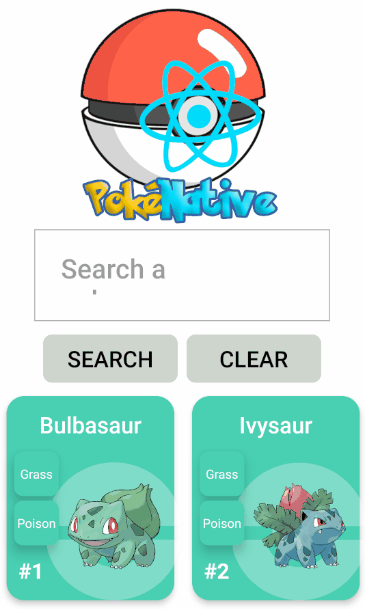

<h1 style="text-align:center">
    
</h1>

<h1 style="text-align:center">
    
</h1>

## 📕 Index

- [About](#-about)

- [Technologies](#-technologies)

- [How to download the project](#-how-to-download-the-project)
---

## 📜 About

The **PokeNative** project is a **Pokedéx** in **React Native** that was developed to put into practice all the knowledge acquired with React Native. Its function is to show all the most important information of each of the pokemon. 

---

## 🚀 Technologies

- [Pokeapi](https://pokeapi.co/)
- [React Native](https://reactnative.dev/)
- [React Navigation](https://reactnavigation.org/)
- [React Hooks](https://reactjs.org/docs/hooks-intro.html)
- [Styled Components](https://styled-components.com/docs/basics)
- [Axios](https://github.com/axios/axios#installing)
 
---
## 📦 How to download the project

```bash
# Clone the repository

$ git clone https://github.com/harlleybastos/poke-native

# Enter in the repository

$ cd poke-native

# Install the dependencies

$ yarn install

# Start the project

$ npx react-native run-android

```

Developed by Harlley dos Santos Bastos 😁🚀